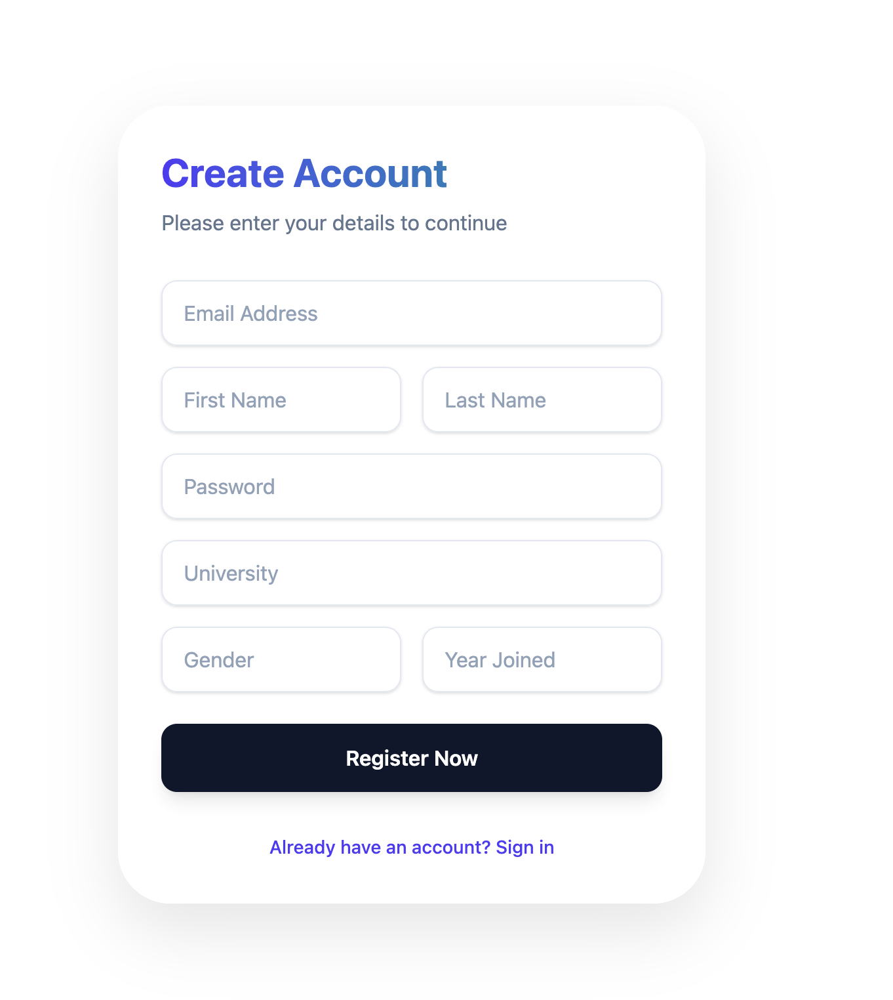
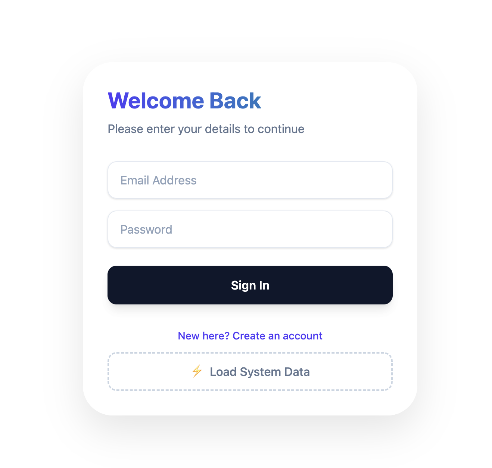
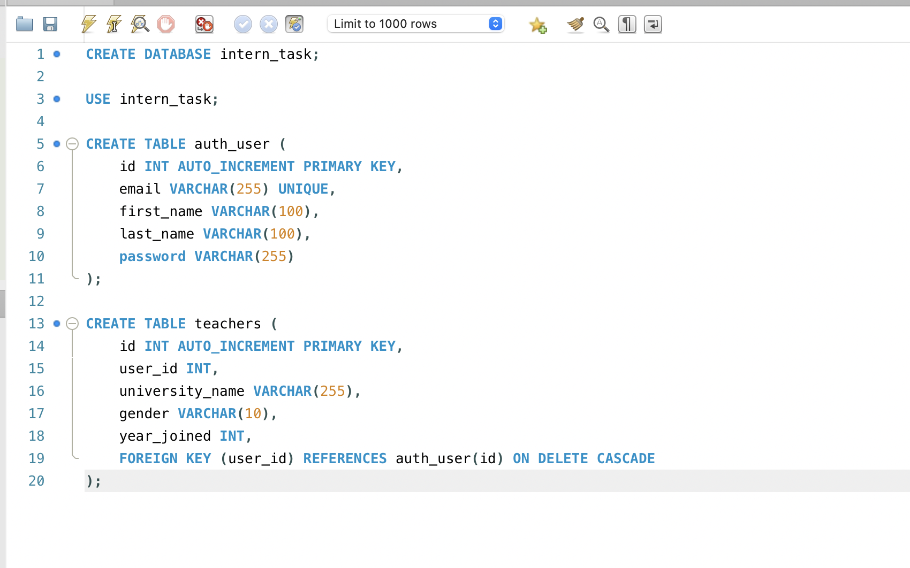

# Intern Task

A complete fullstack web application with authentication, JWT security, and data visualization.

---

## 📌 Tech Stack

### Backend

* CodeIgniter 4 (PHP)
* MySQL
* JWT Authentication

### Frontend

* React (Vite)
* Tailwind CSS
* Axios

---

## ✨ Features

* User Registration (auth_user + teachers tables)
* Secure Login with hashed passwords
* JWT-based authentication
* Protected API routes
* Fetch and display data (Users & Teachers)
* Modern pastel UI with responsive design

---

## ⚙️ Setup Instructions

### 1. Clone Repository

```bash
git clone <your-repo-link>
cd project-root
```

---

### 2. Backend Setup

```bash
cd backend
composer install
php spark serve
```

Create database:

```sql
CREATE DATABASE intern_task;
```

Update `.env` / Database config with your credentials.

---

### 3. Frontend Setup

```bash
cd frontend
npm install
npm run dev
```

---

## 🔐 Authentication Flow

1. Register user → data stored in 2 tables
2. Login → JWT token generated
3. Token stored in localStorage
4. Token used for protected API access

---

## 📊 API Endpoints

| Method | Endpoint  | Description                  |
| ------ | --------- | ---------------------------- |
| POST   | /register | Register user                |
| POST   | /login    | Login user                   |
| GET    | /users    | Get all users (Protected)    |
| GET    | /teachers | Get all teachers (Protected) |

---

## 🎨 UI Highlights

* Pastel gradient theme
* Glassmorphism card design
* Smooth animations & transitions
* Responsive layout

---

## 📸 Screenshots

### 📝 Register Page


### 🔐 Login Page


### 🗄️ Database Tables



---

## 👤 Author

Tejaswini Palwai
